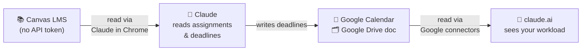

# Canvas Review Blueprint

> **v2** — now a **browser-native Canvas tool catalog for Claude**: the no-token counterpart
> to an MCP server. See [`TOOLS.md`](TOOLS.md) for the full tool list and
> [`CHANGELOG.md`](CHANGELOG.md) for what changed.

A reusable blueprint for turning **Claude** into a **Canvas LMS assistant** — even when your
institution has **disabled personal Canvas API tokens**. It exposes an on-demand catalog of
read-only "tools" (list assignments, read rubrics, check grades & feedback, browse modules …)
plus two scheduled automations built on top of them.

Instead of an API, this system reads Canvas through the **Claude in Chrome** browser
extension, riding your own already-logged-in Canvas session. It then **syncs your deadlines
into Google Calendar and a Google Drive doc** — and that sync *is* the integration: the
claude.ai chatbot can't read Canvas directly, but it *can* read your Google Calendar and
Drive through its native connectors. So the flow is:

This is what makes it an *alternative Canvas integration for Claude* when no API token exists —
Google Calendar and Drive act as the bridge that a Canvas API normally would.

> This repository contains **only the framework** — templates, playbooks, and scheduled-task
> prompts. It ships with **no personal data**. Every value you need to customize appears as a
> `<PLACEHOLDER>` you replace with your own.

## What it does

- **Tool catalog** ([`TOOLS.md`](TOOLS.md)): on-demand, **read-only** tools Claude in Chrome
  invokes against your logged-in Canvas — `list_courses`, `list_assignments`, `get_assignment`,
  `get_rubric`, `get_submission_feedback`, `list_modules`, `get_upcoming_work`, and more. This
  is the "MCP feel": discrete, well-specified capabilities you call as needed.
- **Automations built on the catalog** — two scheduled routines that compose those tools:
  - **Weekly review** (e.g. Sunday evening): a deep dive across active courses — full bodies of
    everything due in the next ~7 days, plus resources and announcements — written to
    `reviews/YYYY-MM-DD.md`.
  - **Daily check** (e.g. Mon–Sat afternoon): a quick scan for *surprise* homework posted
    mid-week, diffed against what's already known.
- **Living memory** (`deadlines.md`): one table that is the single source of truth for every
  known deadline, with a built-in duplicate guard for calendar events.
- **Integration (the whole point)**: the `sync_deadlines` tool mirrors every deadline to a
  Google Calendar and a Google Drive doc, so the claude.ai chatbot can read your Canvas
  workload through its Google connectors — the bridge that replaces a missing Canvas API.

## How this compares to an MCP server

A real Canvas MCP server (e.g. [canvas-mcp](https://github.com/lucanardinocchi/canvas-mcp))
calls the Canvas REST API and **requires a personal API token**. This blueprint targets the
case where tokens are **disabled**: same *shape* — a catalog of named tools — but each tool is
executed by **Claude in Chrome** on your logged-in session instead of over the API, and it is
**strictly read-only**. See the "Coverage vs. canvas-mcp" table in [`TOOLS.md`](TOOLS.md).

## Prerequisites

1. The **Claude desktop app** (its *scheduled tasks* feature runs the routines automatically).
2. The **Claude in Chrome** extension, signed into the same Canvas account you use.
3. A **Google account** with a dedicated Calendar and a Drive doc you control — **required**,
   this is where the deadlines are written.
4. **claude.ai's Google Calendar and Google Drive connectors enabled**, so the chatbot can
   actually read the synced data. Without this, the sync has nowhere to land.

## How to replicate

1. **Copy this folder** somewhere permanent, e.g. `~/Documents/Canvas Review/`.
2. **Open `CLAUDE.md`** and fill in every `<PLACEHOLDER>` with your own values: your folder
   path, timezone, your Google Calendar ID, your Google Drive doc ID (both required for the
   sync), and your Canvas user ID if you want direct submission links.
3. **Set up the two scheduled tasks** in the Claude desktop app using the prompts in
   `TASK-PROMPTS.md` (or the ready-made files in `scheduled-tasks/`). The suggested crons are
   `0 18 * * 0` (weekly, Sunday 6 PM) and `0 16 * * 1-6` (daily, Mon–Sat 4 PM).
4. **Run the weekly task once manually** ("Run now") so you can approve the Claude in Chrome
   browser-control permission; after that, automatic runs won't pause on a prompt.

## File map

| File | Purpose |
|------|---------|
| `CLAUDE.md` | The playbook every Claude session in this folder must follow. Start here. |
| `TOOLS.md` | The read-only tool catalog + coverage-vs-canvas-mcp table. |
| `TASK-PROMPTS.md` | The exact prompts + cron settings for the two scheduled automations. |
| `deadlines.md` | The living-memory table of all known deadlines (starts empty). |
| `reviews/` | One `YYYY-MM-DD.md` file per weekly run (starts empty). |
| `scheduled-tasks/` | Ready-made `SKILL.md`-style copies of the routines. |
| `CHANGELOG.md` | Version history (v1 → v2). |

## Have a Canvas API key?

This blueprint exists for the **token-disabled** case. If your institution *does* let you
generate a personal Canvas API token, you don't need the browser workaround — use the cleaner,
native path:

**➡️ [lucanardinocchi/canvas-mcp](https://github.com/lucanardinocchi/canvas-mcp)** — an MCP
server that wraps the Canvas REST API and connects Canvas **directly** to Claude Desktop
(list/read assignments, rubrics, feedback, even submit work) using your API token.

Rule of thumb: **token available → canvas-mcp; token disabled → this blueprint.**

## License

MIT — see `LICENSE`. Use it, fork it, adapt it freely.
