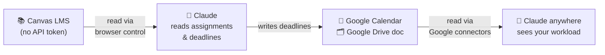

# Canvas Review

**Turn Claude into your Canvas assistant — even if your school blocked Canvas API tokens.**

Ask "what's due this week?" and get a real answer, read straight from your own Canvas account.
Your deadlines get written into a Google Calendar automatically, so they show up on your phone
alongside everything else.

No coding. No terminal. No GitHub account needed.

---

## Before you start — you need a paid Claude plan

Read this bit first so you don't waste time:

| What you need | Why |
|---|---|
| **Claude Pro, Max, Team, or Enterprise** | Reading Canvas needs browser control, which isn't on the Free plan |
| **Claude desktop app** | Browser control needs the desktop app open |
| **Google account** | Your deadlines get saved to Google Calendar + Drive |

**The Free plan will not work.** You can upload this skill on Free, but it won't be able to read
Canvas — that's a limit of the Claude plan, not something this project can work around. Claude
Pro is currently $20/month.

Already have Pro? Great, setup takes about five minutes.

---

## Quick start

1. **Download** `canvas-review.zip` from the
   [Releases page](https://github.com/Minirandomdonut/canvas-review-blueprint/releases).
2. Go to **[claude.ai](https://claude.ai) → Settings → Capabilities** and turn on **code
   execution** (skills need this).
3. Go to **Customize → Skills → Upload skill** and pick the `canvas-review.zip` you downloaded.
4. Connect **Google Calendar** and **Google Drive** in your Claude connector settings.
5. Install the [Claude in Chrome extension](https://claude.com/claude-for-chrome) and make sure
   you're logged into Canvas in that browser.
6. Open the **Claude desktop app → Cowork** and say:

   > **Set up my Canvas tracker.**

Claude asks you two questions (your Canvas web address and your timezone), then builds everything
else itself — it creates the Google Calendar and the tracking doc for you and remembers the IDs.

**There is nothing to fill in by hand.** No config file, no copying folder paths, no hunting for a
Google Calendar ID.

Stuck? See [docs/cowork-setup.md](docs/cowork-setup.md) for the walkthrough with every click, or
[docs/troubleshooting.md](docs/troubleshooting.md).

---

## Then just ask

Once it's set up, in Cowork:

- *"What's due this week?"*
- *"What's the rubric for my history essay?"*
- *"Did my teacher leave feedback on my last submission?"*
- *"Any new homework posted since yesterday?"*

To make it run on its own, see [Scheduled tasks](docs/cowork-setup.md#scheduled-tasks) — a weekly
deep review and a daily surprise-homework check.

---

## What it can do

A catalog of **read-only** tools: `list_courses`, `list_assignments`, `get_assignment`,
`get_rubric`, `get_submission_feedback`, `list_modules`, `list_announcements`,
`get_upcoming_work`, `find_new_tasks`, and `sync_deadlines`.

Full specs in [`skill/canvas-review/references/tools.md`](skill/canvas-review/references/tools.md).

**It never writes to Canvas.** It won't submit work, post to discussions, or change any setting —
that's a hard rule built into the skill, not a preference.

---

## How it works

Your school blocked API tokens, so there's no normal way to connect Canvas to Claude. This works
around that in two hops: Claude reads Canvas through *your own logged-in browser*, then writes
what it finds into Google Calendar and Drive — which Claude can read natively from anywhere.



That Google sync **is** the integration — it's the bridge standing in for the Canvas API you don't
have. It's also why the Google connectors aren't optional.

The Drive doc doubles as the config store, which is why you never have to paste an ID anywhere.

---

## Your data

- Everything stays in **your** Canvas, **your** Google account, and **your** Claude account.
- This repo ships **no personal data** — it's the framework only.
- Canvas access is read-only. The only things written are your own Google Calendar and Drive doc.

---

## Advanced

<details>
<summary><b>Install as a Claude Code plugin instead</b></summary>

If you use Claude Code in a terminal:

```
/plugin marketplace add Minirandomdonut/canvas-review-blueprint
/plugin install canvas-review@canvas-review
```

Then `/reload-plugins`. Same skill, different delivery.
</details>

<details>
<summary><b>How this compares to an MCP server</b></summary>

A real Canvas MCP server calls the Canvas REST API and **requires a personal API token**. This
project targets the case where tokens are **disabled**: same *shape* — a catalog of named tools —
but each tool is executed by browser control on your logged-in session, and it's strictly
read-only. See the "Coverage vs. canvas-mcp" table in
[`tools.md`](skill/canvas-review/references/tools.md).
</details>

<details>
<summary><b>Does your school allow Canvas API tokens?</b></summary>

Then you don't need the browser workaround. Use the cleaner native path:
**[lucanardinocchi/canvas-mcp](https://github.com/lucanardinocchi/canvas-mcp)**, an MCP server
that wraps the Canvas REST API and connects Canvas directly to Claude.

Rule of thumb: **token available → canvas-mcp; token disabled → this project.**

To check: open Canvas → Account → Settings and look for "+ New Access Token". Missing or greyed
out means tokens are disabled.
</details>

<details>
<summary><b>The original desktop-app method (v2)</b></summary>

Earlier versions used desktop-app scheduled tasks with local Markdown files in
`~/Documents/Canvas Review/`. That method still works and is preserved in
[docs/desktop-legacy.md](docs/desktop-legacy.md) — useful if you want your review history as local
files you can read offline.
</details>

---

## License

MIT — see [`LICENSE`](LICENSE). Use it, fork it, adapt it freely.
